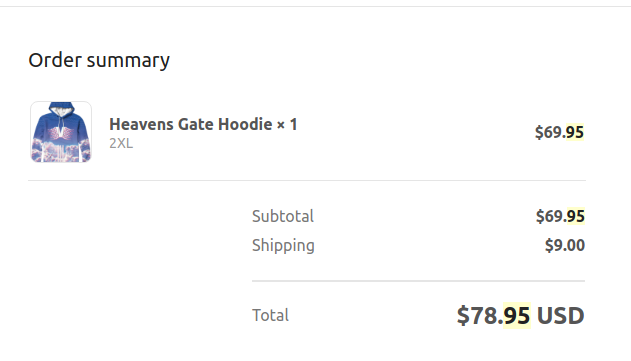
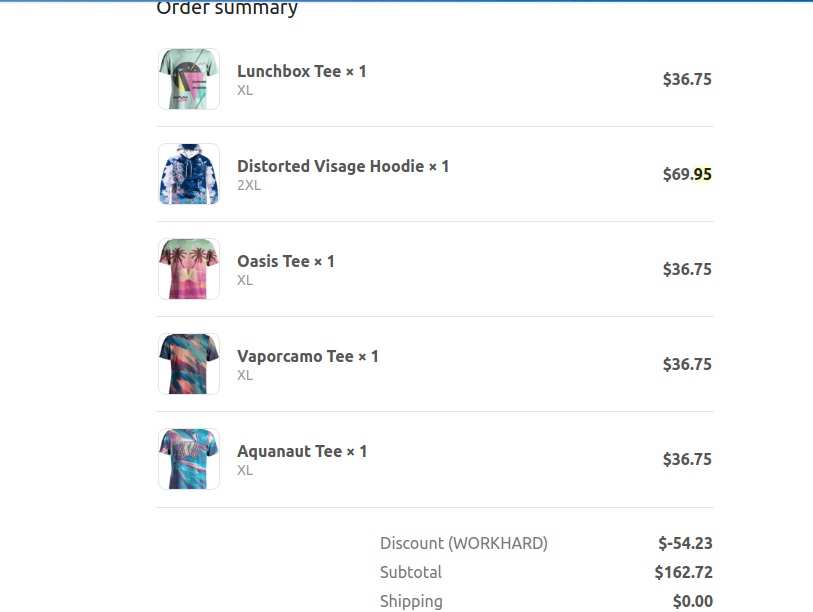
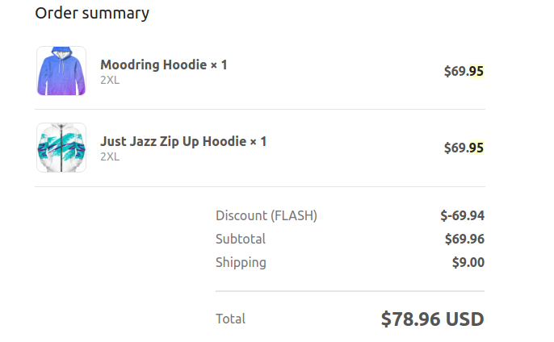

This review has been updated. You can view the previous (outdated) versions by clicking the "view on github" link above, and viewing the commit history.

Here's the gist of it: I initially had some issues with Vapor95, but the owner reached out to me and has been very responsive and put a lot of work in to resolve the issues I brought up in the old version of this review. I am confident to recommend Vapor95 again after seeing the owner's dedication to improving their business. Overall, I would consider Vapor95 a top contender for Vaporwave style clothing. For more details, see the full review text below.

### Onto the review...

Back in 2017 I purchased a _lot_ of vaporwave-style aesthetic clothing. One of the first brands I purchased was Vapor95. I have made multiple orders with them, totaling several hundred dollars. I gave some of the clothing as gifts, and have pointed them out to some friends who have also spent combined hundreds on the site. This was before I got my first order, because I was pretty hyped. More info below.

### Order 1, Early September, 2017

My first order(s) were quite ambitious having never bought from them before, and not being able to find any reviews. I first bought the Heaven's Gate hoodie to test the waters a bit, but a mere three days later I put in a much larger order (before my first one was even shipped) because I hungered for that a e s t h e t i c. Overall, the shirts had great print quality. Note that they are polyester though, so they will be stretchier and a bit thinner than cotton. Also note that the hoodies are suited best for spring/fall weather. They are also a bit thin which makes them good for between-season hoodies and good for chilly days, but I would combine a winter jacket with them when temperatures are below 40-45F or so. The hoodies are cotton though. The zippers are plastic, which isn't a big deal as long as you aren't tugging them hard or being rough with them. Personally, I have not had a zipper fail on me yet. The Distorted Visage hoodie looks quite good, and the Heaven's Gate hoodie looks awesome. The Lunchbox, Oasis and Aquanaut tees look good as well. For the pricing of the shirts, they may seem a bit high but keep in mind that they are made-to-order in America, so you are supporting American business and keeping away from bad labor conditions and sweatshops. 

I had an issue with the Vaporcamo shirt, when it arrived, it was a bit blurry. However, after getting in contact with the owner I was notified that there was an issue with the file they sent to the printing company and it has since been rectified. I have since ordered another Vaporcamo shirt and the quality was much improved.

#### Support
After being contacted by the owner based off my previous review posted here, many of the gripes I had with the site were resolved, and the owner seemed very willing to listen to feedback and put in work to make it right. I really appreciate that, and will update this section further if I end up needing more support from the site. They have also switched their return policy from "no returns" (due to the made-to-order process) to accepting returns graciously.

### Order 3, Mid October, 2017
This was my third order from Vapor95, and the last one I made before making this review and having my concerns alleviated by the owner. 

I ordered the "Just Jazz" and "Moodring" hoodie here. I opted for the Moodring hoodie instead of a blanket. The Just Jazz hoodie looks good, but is a bit too thin for New England winters as I said before. Still works for the other seasons though or in combination with a jacket.

### Review process
When I first made this review, the only way to review products was on the website which has reviews that can be controlled by the owner. Since then though, after getting in contact with the owner, they have enabled reviews on their [Facebook page](http://facebook.com/vapor95store) which has permanent reviews. They have also become much larger since the initial review, so any concerns I had about them being a new/small company without a reputation are gone.

## Conclusions
Overall, Vapor95 is a strong contender for the vaporware market. While I did have some issues initially, as I've stated a few times in this revised review, the owner did a great job sorting them out. As I said in the original review, I would resume patronage once they fixed the issues, and here we are. If you are looking for good quality aesthetic clothes, they are a solid choice. The print quality is great, with the Moodring shirt being the only potential exception I've seen so far, and after they fixed the Vaporcamo shirt. Pricing may seem a bit high, but I am fine with that as the shirts are made in America, and I like supporting the workforce. Compared to the other brands out there though, pricing is about right.

If you have a craving for aestheticware like I do, check out [cool shirtz](https://shirtz.cool/). I love their stickers, and I own their [Alone](https://shirtz.cool/collections/frontpage/products/the-alone-tee?variant=36455483274) and [Meadow](https://shirtz.cool/collections/frontpage/products/the-meadow-tee?variant=36621467210) full print tees. The polyester has 10% cotton as well, so they are a little bit thicker than other brands. The print quality is as good as any for these as well. Definitely order your size or one size down for coolshirtz though, otherwise it's like wearing a dress!

Thanks for reading. If you have questions, feel free to send me a mail at v95review@put.nu
- Sam
