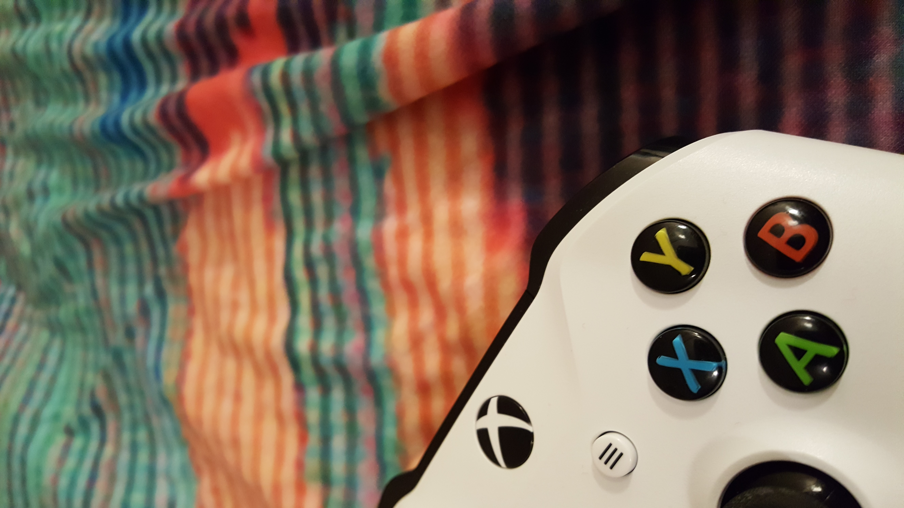
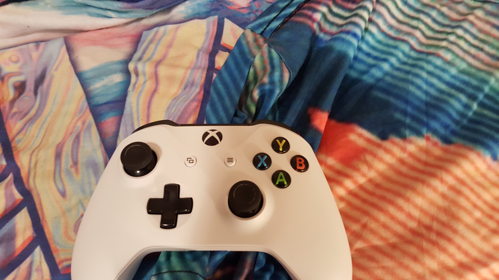
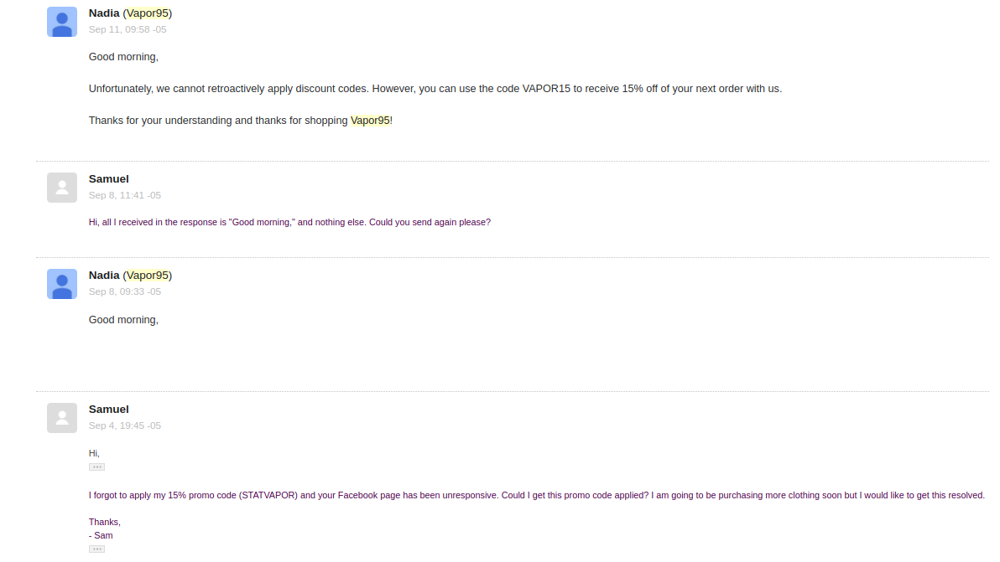
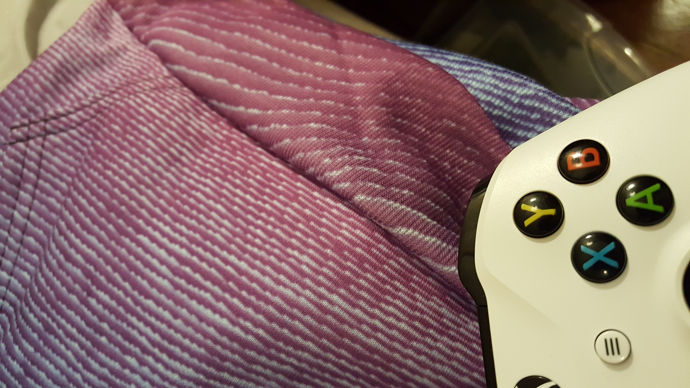
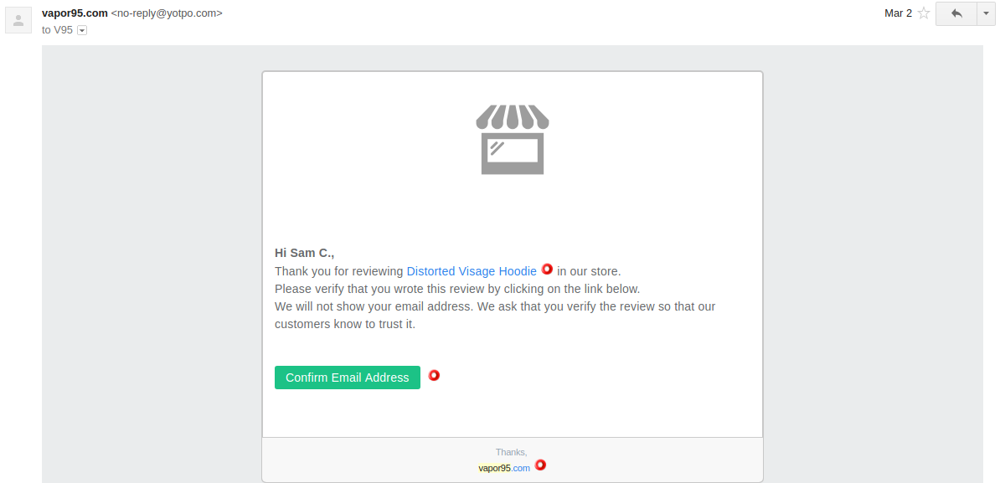
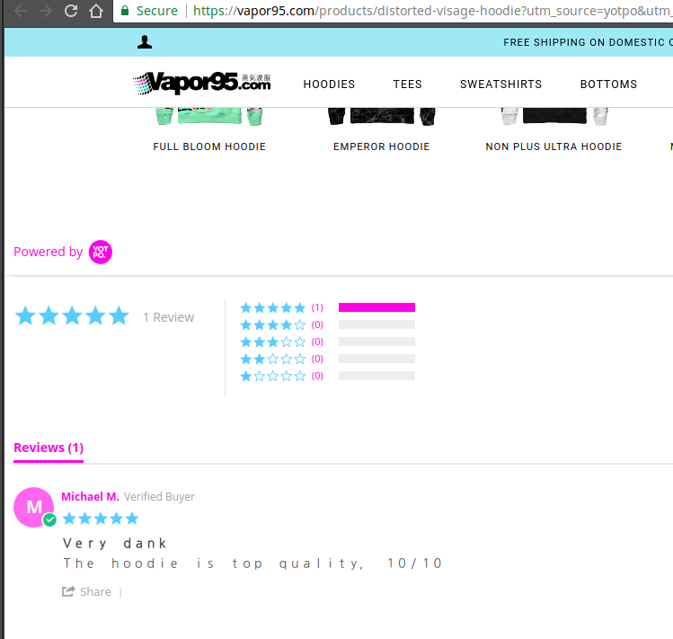

Here's the gist of it: This brand is pretty hit or miss with the quality of their shirts, but their practices and "support" are sketchy at best.

### Onto the review...

Back in 2017 I purchased a _lot_ of vaporwave-style aesthetic clothing. One of the first brands I purchased was Vapor95. I have made 3 orders with them, totalling over $300. I gave some of the clothing as gifts, and pointed them out some friends who have also spent combined hundreds on the site. This was before I got my order though. 

### Order 1, Early September, 2017
![Order 2] (order-2.png)

My first order(s) were quite ambitious having never bought from them before, and not being able to find any reviews. I first bought the Heaven's Gate hoodie to test the waters a bit, but a mere three days later I put in a much larger order (before my first one was even shipped) because I hungered for that a e s t h e t i c. Overall, the shirts were okay, but the polyester content made them stretchy and a bit thin. The quality is nowhere near what the price is. The hoodies are extremely thin for $70-$80 and the zippers are a cheap chrome-plastic, and I would expect to pay more like $40 for the quality you get. However, the Distorted Visage hoodie did look quite good despite not being super functional, and the Heaven's Gate hoodie looks awesome. The Lunchbox, Oasis and Aquanaut tees looked good as well, but again they are quite thin, and I am not sure if they are worth $37 each (more like $25 or so, I would say). This, on top of the several weeks it takes for the order to go through is a bit odd. I say this, because they claim all their shirts are made to order. If this were the case, why do we get tragedies like the **Vaporcamo shirt**? The Vaporcamo shirt, oh boy. This thing is extremely blurry, a fact you can't see in the photos on their website.

I've included an Xbox controller in the photos so you can see that the camera is in focus, and that the shirt is really blurry. Believe me, it looks atrocious in person.
Check it out:

Here you can see it in comparison with the Aquanaut tee.

So at this point I'm already about $250 deep into this site, and a few of my friends purchased some stuff before I even got mine when I pointed the site out to them.

#### """Support"""
Shortly after I placed my first order for the Heaven's Gate tee, I realized I had forgot to apply a promo code, so I reached out to them to see if I could get it applied retroactively. Something like this, on any website even such as Amazon would be quite easy to do, and they likely would refund you some money if they had to. However, unfortunately, you won't find excellent or even timely customer support from Vapor95. Check out the exchange below (bottom is oldest, top is newest):

So I finally got my order at the end of September, and noticed how poor the vaporcamo shirt was. I went to ask for a refund or replacement, wondering how such a blurry mess could be shipped out if the shirts were made to order and inspected. I expected more quality from a $37 shirt. However, I was told that because of the made-to-order process, they do not accept returns. This seems kind of ridiculous, because they could easily just restock it and ship it out much faster to someone else if the shirt is still mint (which it is). I figured it was probably a fluke and then I made my third order.

### Order 3, Mid October, 2017
This was my third, and final order from Vapor95. 

I ordered the "Just Jazz" and "Moodring" hoodie here. I opted for the Moodring hoodie instead of a blanket. When I received them about 3 weeks later, I was _very_ dissapointed in the Moodring hoodie. It was incredibly faded out and looked nothing like the picture. The blue is way more prominent than the purple, and it only barley starts to turn purple towards the end. This hoodie was also blurry like the Vaporcamo shirt. The Just Jazz hoodie looks good, but again, the zipper is very poor quality and the material is very thin. Quite unbecoming of a $70 shirt.

Take a look at the Moodring hoodie in real life:
You can see there is very little purple or gradient.

Notice how it is blurry like the Vaporcamo shirt.

### Sketchy review process
If you take a look on the vapor95 site, they have added reviews, sometime likely in late October or early November. However, you will not see a single review under 4 stars on the site, because they filter through the reviews before they post them. I posted a 3 star review and some others on products I purchased after receiving an invitation to do so by mail, but after posting my reviews they did not show up, even after some months of time has passed. This is very suspicious, especially as they are allowed to pick and choose what reviews show up.

Here is one of those invitations I took in early March:

And here is the reviews page:

## Conclusions
Overall, vapor95 has some good clothing, but the quality is very hit or miss, and with a 3 week wait time and no returns, it's just too risky for me. The lack of any negative reviews is also concerning, especially because those are usually more common than good reviews even on good products. People are more likely to complain than praise. This combined with their support practices and return policy makes them a solid "miss" for me, and I won't be buying any more clothing from them until they get this stuff sorted out. 

If you have a craving for aestheticware like I do, I have been trying out other sites such as [publicspace.xyz](https://www.publicspace.xyz/) and [cool shirtz](https://shirtz.cool/) as alternatives. I bought the [VHSMax Onesie](https://www.publicspace.xyz/collections/onesies/products/onesie-limited-release-1-of-101) from publicspace, and found the quality of the print to be fantastic. It is a bit tight, though, so order a size larger than you normally wear. I just wish they made it with knee pads and kevlar lining so I could wear it to the track on my motorcycle. As for cool shirtz, I love their stickers, and have ordered the [Alone](https://shirtz.cool/collections/frontpage/products/the-alone-tee?variant=36455483274) and [Meadow](https://shirtz.cool/collections/frontpage/products/the-meadow-tee?variant=36621467210) full print tees. The polyester isn't as thin as the vapor95 shirts because they have 10% cotton content, and the quality is very sharp and they look great. For these, definitely order your size or one size down though, otherwise it's like wearing a dress!

Thanks for reading. If you have questions, feel free to send me a main at v95review@put.nu
- Sam
